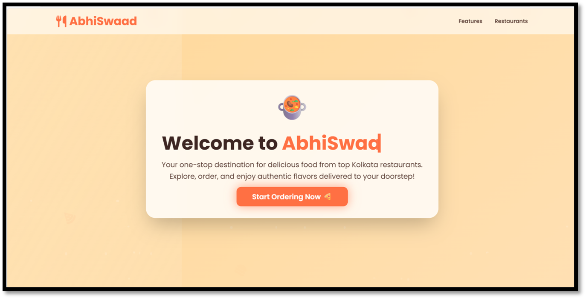
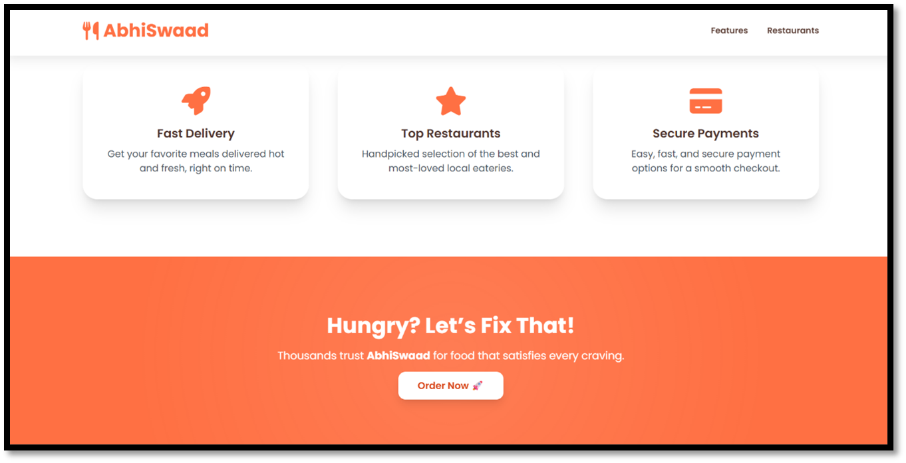
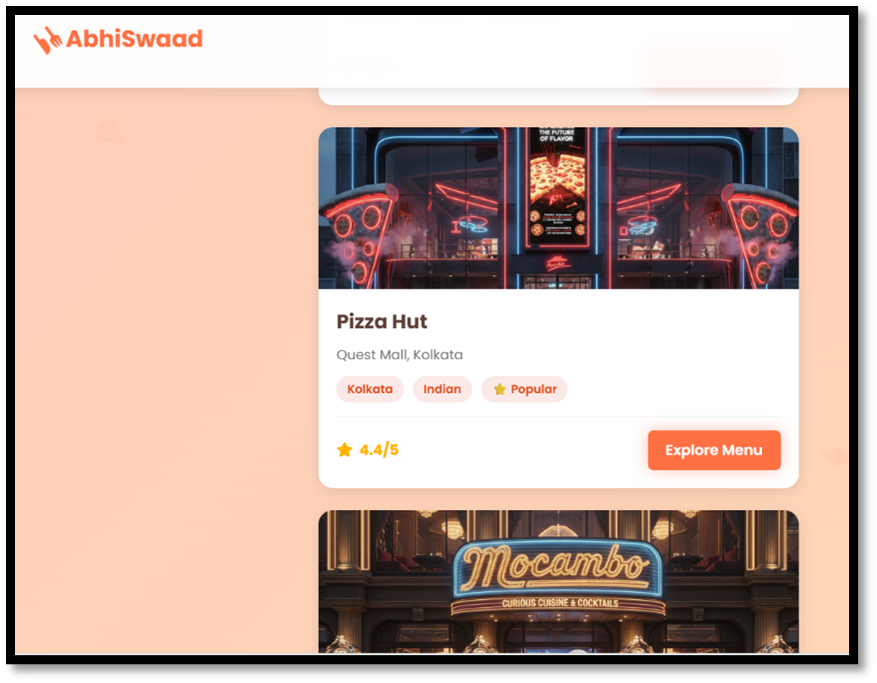
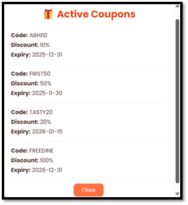
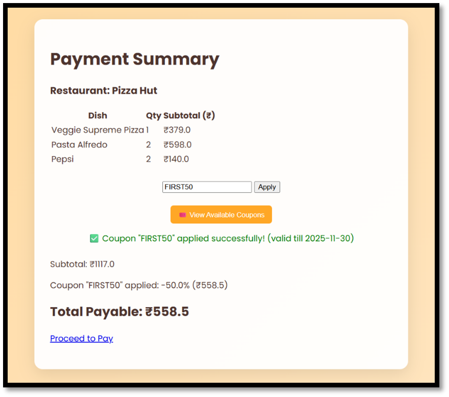

# 🍽️ AbhiSwaad – Food Order Management System

AbhiSwaad is a Java-based food order management web application that allows users to browse restaurants, explore menus, place food orders, apply discount coupons, view payment summaries, and download PDF bills.  
The project is built using JSP, Java Servlets, MongoDB, and Apache Tomcat, following a 3-Tier Architecture.

---

## 🚀 Features

### 👨‍🍳 User Features
- User Registration & Login using HTTP Sessions
- Browse popular Kolkata restaurants
- View restaurant-wise food menus
- Select food items with quantity control
- Apply discount coupons (FIRST50, ABHI10, etc.)
- View real-time payment summary
- Generate and download PDF bill
- Secure logout functionality

### 🧑‍💼 Admin Features
- Admin login
- View all user orders
- Update order status (Pending / Paid / Delivered)
- Manage restaurant and menu data

---

## 🧩 System Architecture

Presentation Layer (JSP, HTML, CSS)  
↓  
Controller Layer (Java Servlets)  
↓  
DAO Layer (Database Operations)  
↓  
MongoDB Database  

---

## 🛠️ Tech Stack

Frontend  : JSP, HTML, CSS, JSTL  
Backend   : Java Servlets (Jakarta Servlet API)  
Database  : MongoDB  
Server    : Apache Tomcat 10.1  
Build     : Apache Maven  
PDF       : iTextPDF  
IDE       : IntelliJ IDEA  

---

## 📸 Screenshots

## Home Page

## Features Window

## Restaurants Browsing Page

## Menu Page (Pizza Hut)

## Available Coupons

## Payment Summary

## PDF Bill Generated

---

## ▶️ Steps to Run (Using IntelliJ IDEA)

1. git clone https://github.com/Abhik-08/AbhiSwaad.git

2. cd AbhiSwaad

3. mvn clean install

4. Open IntelliJ IDEA  
File -> Open -> Select AbhiSwaad folder  
5. Set Project SDK -> JDK 17 + 
6. Run -> Edit Configurations -> Add Tomcat (Local)  
7. Select Apache Tomcat 10.1  
8. Click Run ▶️  

9. Ensure MongoDB is running locally:  
mongodb://localhost:27017  

10. Application URL:  
http://localhost:8080/AbhiSwaad  

---

## 🧠 Future Enhancements

- Online payment gateway integration (UPI, Debit/Credit Cards)
- Live order tracking system
- Sales analytics and reporting dashboard
- AI-based food recommendations
- Mobile application (Android / iOS)
- Cloud deployment using MongoDB Atlas

---

## 👨‍💻 Developed By

Name    : Abhik Mukherjee  
Degree  : B.Tech CSE  
College : Dr. B.C. Roy Engineering College, Durgapur  
GitHub  : https://github.com/Abhik-08  
LinkedIn: https://www.linkedin.com/in/abhik-mukherjee-b6a15920a  
Email   : abhikmukherjee2003@gmail.com
